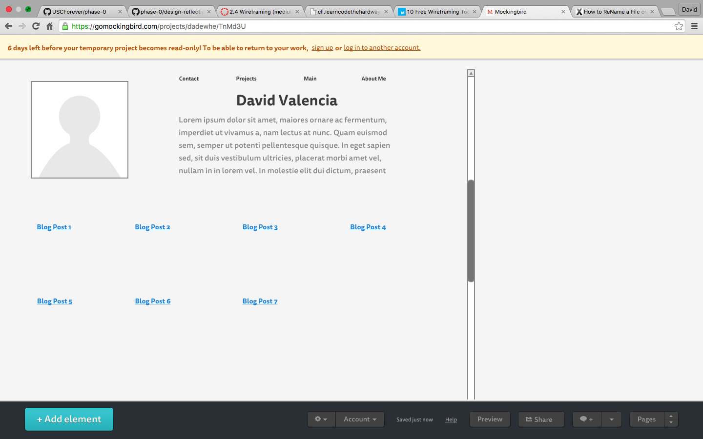

#What is a wireframe?
A wire-frame is an outline of what a developer wants a website to look like that they construct prior to developing the website.  This is similar to how a filmmaker will storyboard a scene prior to filming it on camera.

#What are the benefits of wireframing?
The benefits of wireframing are that you get to envision what your site will look before you dive into the code.  It also allows you to organize your thoughts and keep to the plan when you are actually building your website so you stay on track.

#Did you enjoy wireframing your site?
I did.  I have built websites before using templates and tumblr so I can definitely see the value add of planning the site out ahead of time.

#Did you revise your wireframe or stick with your first idea?
I really just stuck with my first idea.  I have a really concrete idea of what I think a professional site should look like, so I really just went with that vision.

#What questions did you ask during this challenge? What resources did you find to help you answer them?
I didn't really ask myself any questions when going through this challenge, I thought the tools provided for in the releases were helpful enough to complete the task.

#Which parts of the challenge did you enjoy and which parts did you find tedious?
I could see wireframing becoming tedious if you are building a similar type of website over and over again, but I think it is a very good process for new ideas.