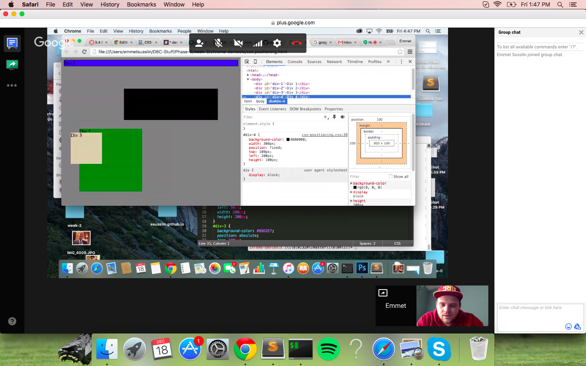
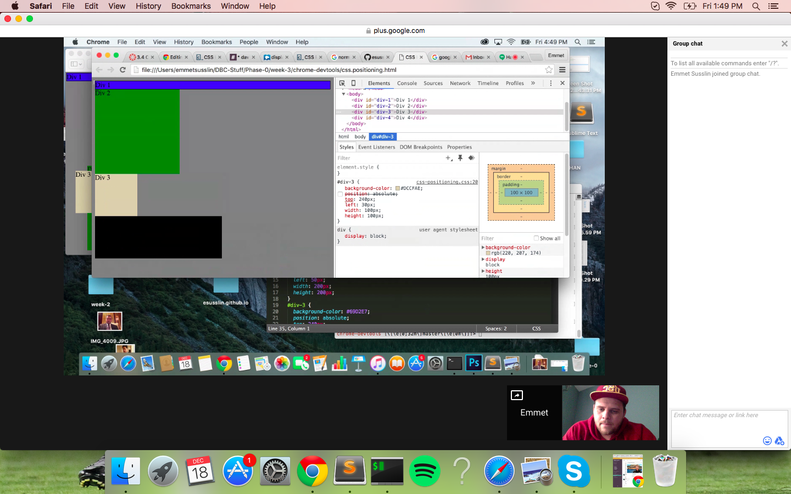
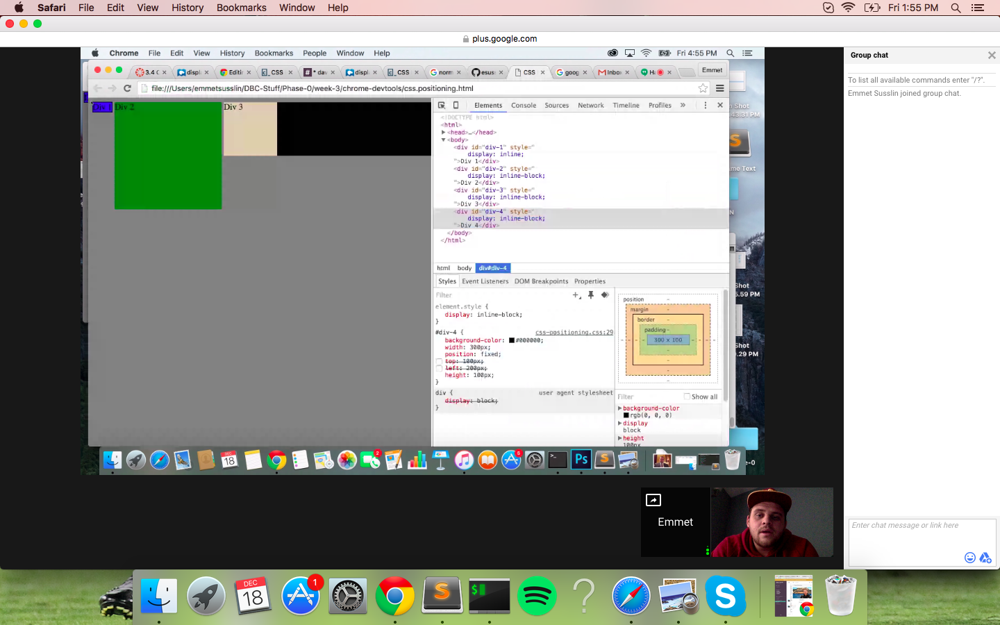
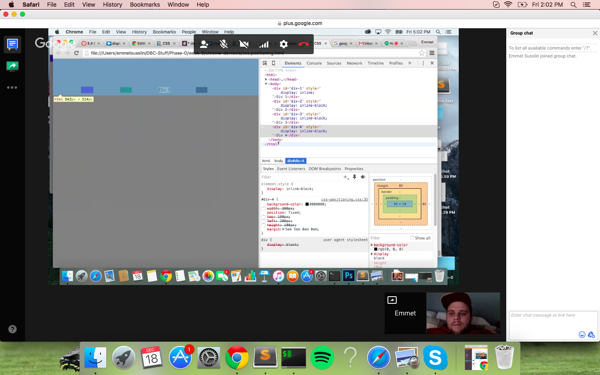
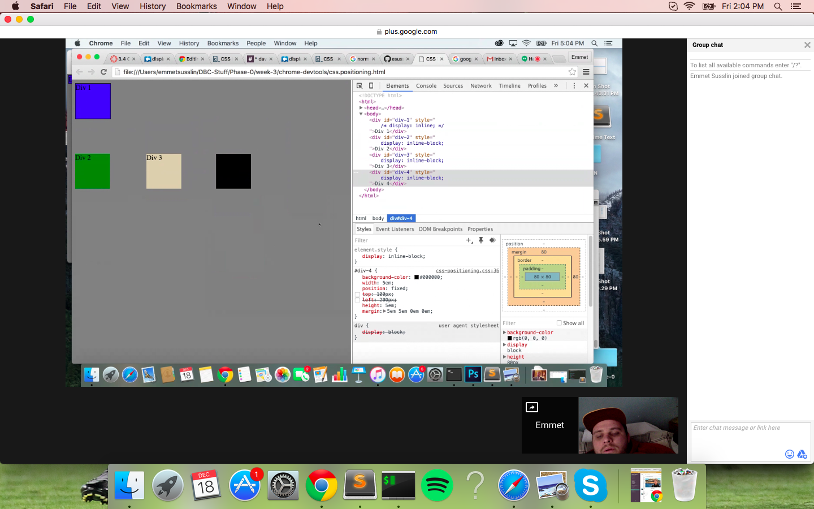
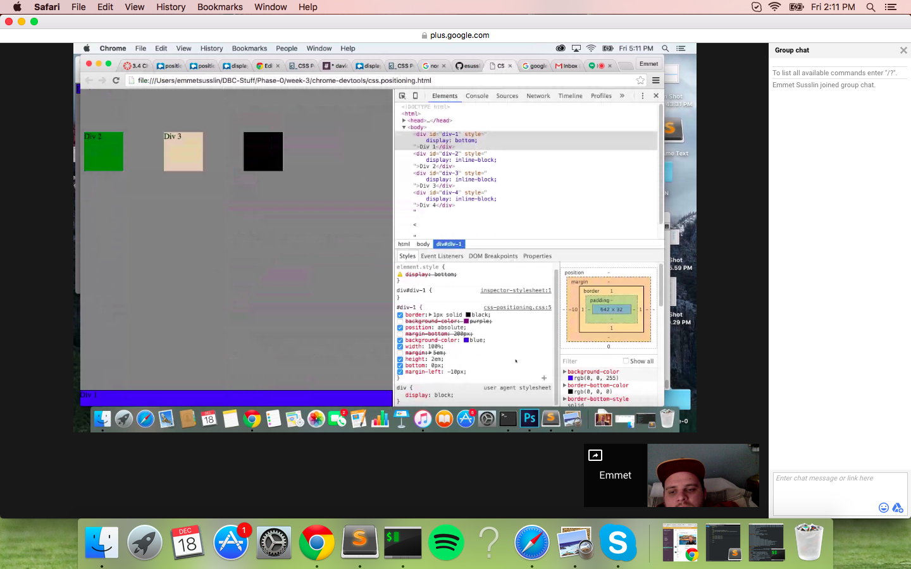
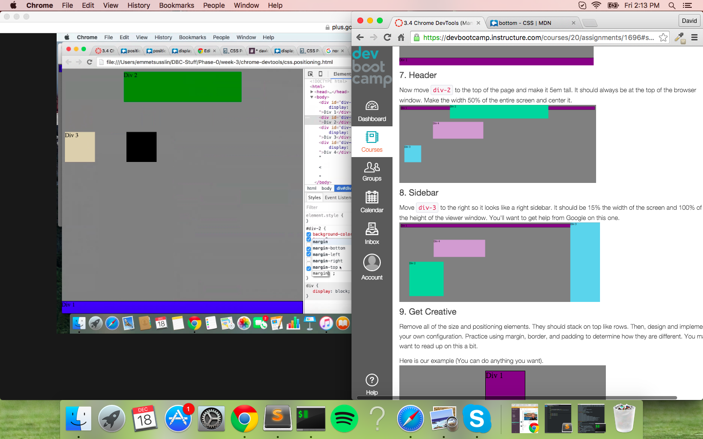
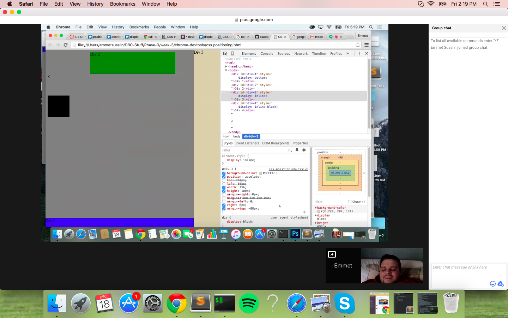
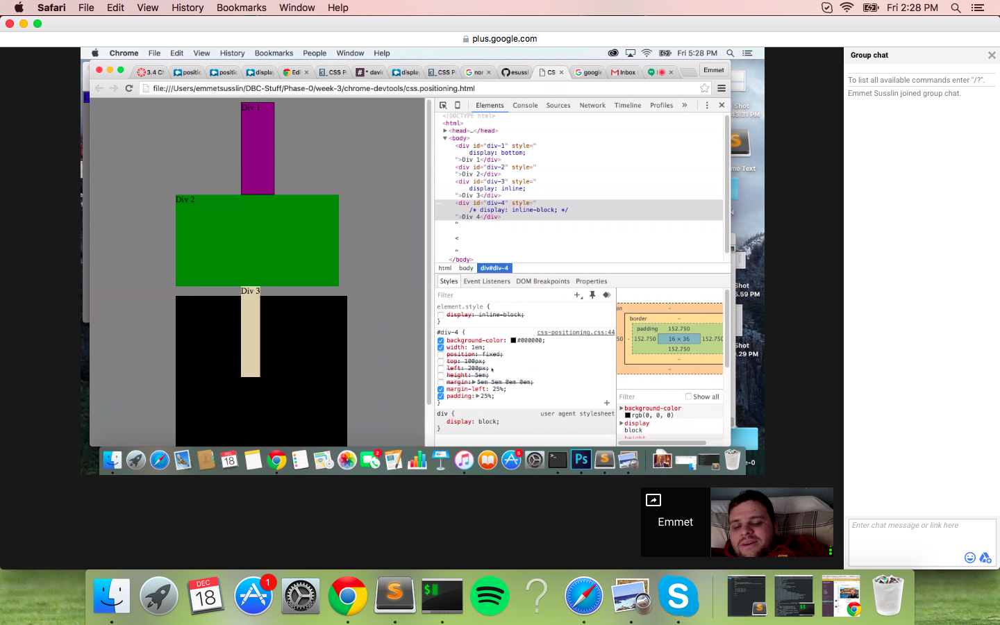

#How can you use Chrome's DevTools inspector to help you format or position elements?

Using DevTools, it is easy to apply changes to the elements or take away current formatting so that you can see the result of your potential actions.  This is very useful for quickly seeing how potential css changes would affect positioning and formatting on the page without having to relaunch the local html file in the browser again and again.

#How can you resize elements on the DOM using CSS?

You can resize elements on the DOM by changing the current sizing elements that are already within the webpage or by writing your own using CSS.  An example of this would be width: 50%;.

#What are the differences between absolute, fixed, static, and relative positioning? Which did you find easiest to use? Which was most difficult?

Static is the default position that elements take on.  Absolute makes the element be positioned relative to the parent element.  Fixed will make the object stay in the same position on the page, even when the user scrolls.  Relative positioning will make the object move relative to where it would be if it was static.  The easiest for me to use was static because you can use floats to organize the way the objects will move.  The hardest one for me to use was relative because it is difficult for me to guess where the object would be without the positioning.

#What are the differences between margin, border, and padding?

Border is the outermost layer of the space surrounding an object, margin is the 2nd outermost, and padding is the 3rd most.  Increasing padding size will push the margin out, which will push the border out.  Increasing margin size will only push the border out however.

#What was your impression of this challenge overall? (love, hate, and why?)
I liked this challenge because it gave me the opportunity to expand my working knowledge of CSS a bit.  The largest thing I am still struggling with is using other types of positioning besides static.