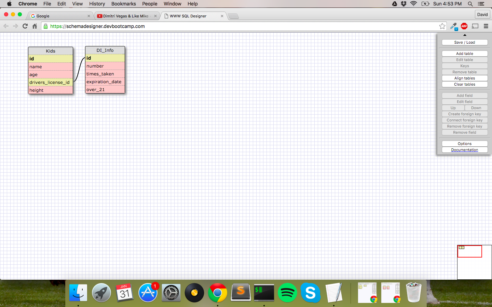
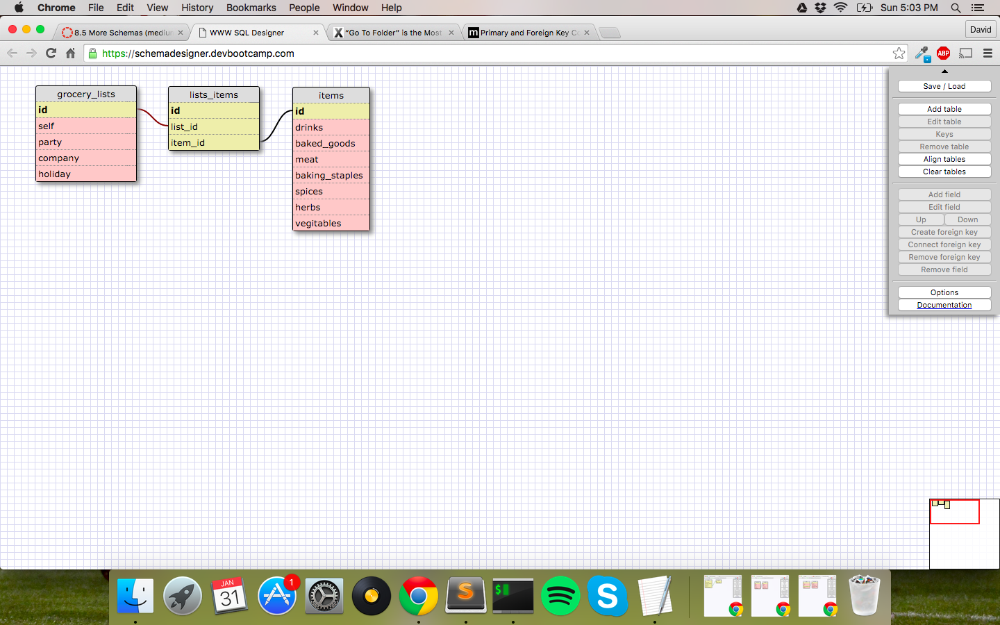

This relationship is one-to-one because not all of the kids have turned 16 yet, and thus do not have their driver's license info.  This way, the id can be empty if there is no info and contain information if the kid has a driver's license.

###What is a one-to-one database?

A one-to-one database is when a foreign key in one table connects to a primary key in another table.  This allows this key to access information from that table that only exist once.

###When would you use a one-to-one database? (Think generally, not in terms of the example you created).

You would use a one-to-one database generally when you are trying to tie one object to another table that could either have information or be empty.

###What is a many-to-many database?

A many-to-many database is one where the primary keys of 2 tables are connected by a join table to foreign keys.  This table allows both of the 2 tables to be connected by their id types.

###When would you use a many-to-many database? (Think generally, not in terms of the example you created).

I would use a many-to-many database for organizing a database of objects that tie to a group within listing of other objects that are connected.  For example, tying natural disasters in one table to another table that includes attributes like warning signs, rain, and other elements.

###What is confusing about database schemas? What makes sense?

I think that what I am still a bit confused about are the created_at and updated_at fields in green in the bottom of the example.  I didn't really see a place in one of the releases where we went over that, but I assume it tracks when the other fields have been created or changed within the database.  I think most of the things from this release makes sense if you think of it as a bunch of excel tabs interacting with one another.